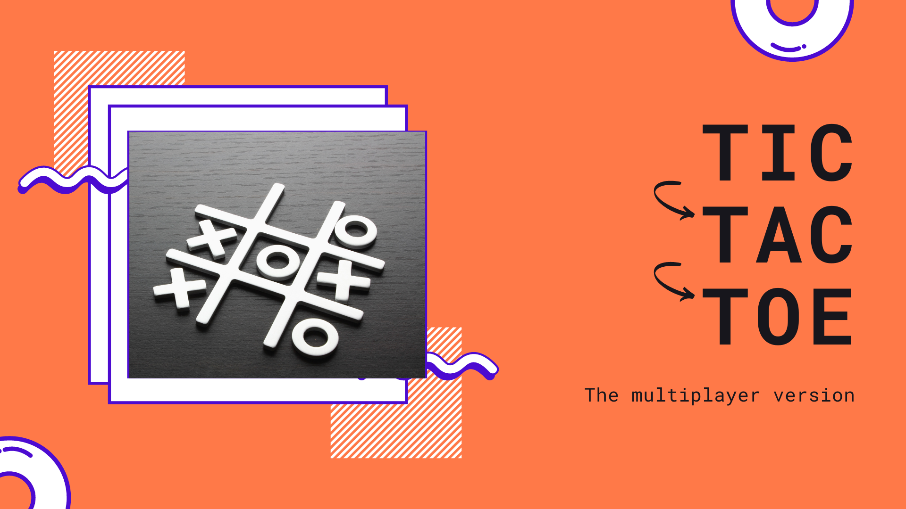

# Tic-Tac-Toe

A standard tic-tac-toe game with multiplayer support.



## Prerequites

1. You must have node installed. [Download an LTS version (preferably 14)](https://nodejs.org/)
2. You must have redis locally. Refer to [the redis website](https://redis.io/topics/quickstart) to install redis
3. Finally, you must have the [adonis cli](https://adonisjs.com/).

```bash
npm i -g @adonisjs/cli
```

## Installation

To install the project locally, first clone the project

```bash
git clone https://github.com/vicradon/tic-tac-toe
```

Then install dependencies

```bash
npm i
```

### Running the servers

1. Webserver

```bash
adonis serve --dev
```

2. Redis server

```bash
redis-server
```

3. Webpack watcher

```bash
npm run watch
```

## Licence

MIT
